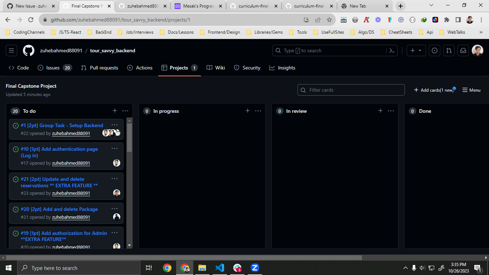

# Tour Savvy App Backend
<a name="readme-top"></a>

# 📗 Table of Contents

- [📖 About the Project](#about-project)
  - [🛠 Built With](#built-with)
    - [Tech Stack](#tech-stack)
    - [Key Features](#key-features)
- [💻 Getting Started](#getting-started)
  - [Setup](#setup)
  - [Prerequisites](#prerequisites)
  - [Install](#install)
  - [Usage](#usage)
  - [Run tests](#run-tests)
  - [Api documentation](#api-doc)
- [👥 Kanabn](#kanban)
- [👥 Authors](#authors)
- [🔭 Future Features](#future-features)
- [🤝 Contributing](#contributing)
- [⭐️ Show your support](#support)
- [🙏 Acknowledgements](#acknowledgements)
- [📝 License](#license)

<!-- PROJECT DESCRIPTION -->

# 📖 [Tour_Savvy_Backend] <a name="about-project"></a>

Tour_Savvy is a rails api app that allows operations like get, delete, post for packages and reservations. It also supports authentication for user login and signup.

## 🛠 Built With <a name="built-with"></a>

### Tech Stack <a name="tech-stack"></a>

<details>
  <ul>
    <li><a href="https://www.postgresql.org/">Postgresql v15.3</a></li>
    <li><a href="https://rubyonrails.org/">Ruby on Rails v7.1.1</a></li>
    <li><a href="https://rspec.info/">Rspec v3.12</a></li>
  </ul>
</details>

<!-- Features -->

### Key Features <a name="key-features"></a>

- **Index and Show Packages**
- **Index and Show Reservations**
- **Add/Remove Reservation**
- **Add/Remove Package**
- **Authentication**

<p align="right">(<a href="#readme-top">back to top</a>)</p>


<!-- GETTING STARTED -->

## 💻 Getting Started <a name="getting-started"></a>

To get a local copy up and running, follow these steps.

### Prerequisites

In order to run this project you need: 

```sh
 [Ruby] (https://rubyinstaller.org/downloads/)
 Rails: gem install rails
```
### Setup

Clone this repository to your desired folder:

```sh
  git clone https://github.com/zuhebahmed88091/tour_savvy_backend.git
```

### Install

Install this project with:

```sh
  cd tour_savvy_backend
  bundle install
```

### Database setup:
Run these commands to create and update database
```
rails db:create
rails db:migrate
rails db:seed
```
### Usage

To run the project, execute the following command:

```sh
  rails server
  configure database.yml in config to user your postgres database
  rails db:seed (this is to seed a admin in database)
```

### Run tests

To run tests, run the following command: 

Example command:

```sh
  rspec ./spec/models
```

### Api documentation

The api documentation is only a simple demonstration to use full features you need to implement proper configuration on your frontend, you need to send back the token that is sent on login response data to subsequent api calls for api endpoints to work (except for get method of packages).
You need to start server first to access api (rails server)

## _[Api doc link](http://localhost:3000/api-docs/index.html)_

<p align="right">(<a href="#readme-top">back to top</a>)</p>

<!-- AUTHORS -->

# Tour Savvy App


## Kanban:
## _[URL to the Kanban](http://localhost:3000/api-docs/index.html)_
<br>
<br>



## Authors:

👤 **Marvin Otieno**

- [GitHub](https://github.com/marvin-nyalik)
- [WellFound](https://wellfound.com/u/marvin-otieno)
- [Twitter](https://twitter.com/NyalikMarvin)

👤 **MD. Nohain Islam**
- [GitHub](https://github.com/Zafron047)
- [Twitter](https://twitter.com/NohainZ)
- [LinkedIn](https://www.linkedin.com/in/nohain-islam/)

👤 **MesakDuduCoder**

- [GitHub](https://github.com/MesakDuduCoder)
- [Twitter](https://twitter.com/mesak_10)
- [LinkedIn](https://www.linkedin.com/in/mesak-lalrindika/)

👤 **Zuheb Ahmed**

- [GitHub](https://github.com/zuhebahmed88091)
- [Twitter](https://twitter.com/ZuhebAhmed88091)
- [LinkedIn](https://www.linkedin.com/in/zuheb-ahmed/)

<p align="right">(<a href="#readme-top">back to top</a>)</p>

<!-- FUTURE FEATURES -->

## 🔭 Future Features <a name="future-features"></a>

**Search feature**
<br>
**Archive transactions**

<p align="right">(<a href="#readme-top">back to top</a>)</p>

<!-- CONTRIBUTING -->

## 🤝 Contributing <a name="contributing"></a>

Contributions, issues, and feature requests are welcome!

Feel free to check the [issues page](https://github.com/zuhebahmed88091/tour_savvy_backend/issues).

<p align="right">(<a href="#readme-top">back to top</a>)</p>

<!-- SUPPORT -->

## ⭐️ Show your support <a name="support"></a>

If you like this project please feel free to check it out on my GitHub and give me a star thanks.

<p align="right">(<a href="#readme-top">back to top</a>)</p>

<!-- ACKNOWLEDGEMENTS -->

## 🙏 Acknowledgments <a name="acknowledgements"></a>

I would like to thank Microverse, my learning partners for the support upon the completion of this project.

I would also like to give a big thanks to Murat Korkmaz for this design he provided on behance.

<a href="https://www.behance.net/gallery/26425031/Vespa-Responsive-Redesign">Link to design</a>

<p align="right">(<a href="#readme-top">back to top</a>)</p>

<!-- LICENSE -->

## 📝 License <a name="license"></a>

This project is [MIT](./LICENSE) licensed.

<p align="right">(<a href="#readme-top">back to top</a>)</p>

